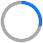
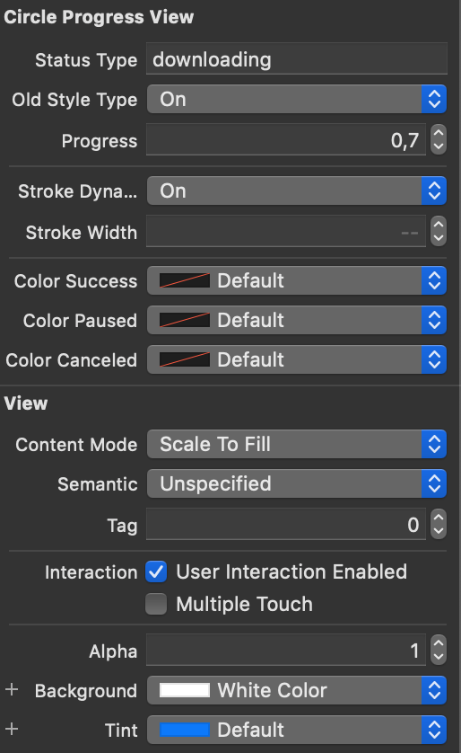

# CircleProgressView

[](https://cocoapods.org/pods/UICircleProgressView)
[](https://cocoapods.org/pods/UICircleProgressView)
[](https://cocoapods.org/pods/UICircleProgressView)

#### An slim, AppStore like download-progress circle-indicator view.
<small>All graphics are done using only `CAShapeLayer`s with `UIBezierPath`s and are animated with `CAAnimation`. Therefor no additional assets are required, making all aspects fully customizable.</small>

> Preview `old`-Style: <br>
>  

> Preview `new`-Style: <br>
>  

## Installation

UICircleProgressView is available through [CocoaPods](https://cocoapods.org/pods/UICircleProgressView). To install
it, simply add the following line to your Podfile:

```ruby
pod 'UICircleProgressView'
```

## Example

Use either:

- the Interface-Builder to create a `UIView` and set it's base-class to `UICircleProgressView`
- create a UICircleProgressView in source:

```swift
import UICircleProgressView

let progressView = UICircleProgressView(frame: CGRect(x: 0, y: 0, width: 24, height: 24), style: .new, status: .waiting)
progressView.tintColor = .blue

// starting download...
progressView.status = .downloading

for progress in stride(from: 0.0, to: 1.0, by: 0.01) {
    progressView.progress = CGFloat(progress)
    usleep(20000)
}
progressView.status = .success
```

> For a full example-project see: [example.xcodeproj](./example.xcodeproj) or just the [ViewController.swift](./example/ViewController.swift)

## Usage

The following properties are exposed to customize and controll the progressView:

| property | behavior | type / values |
|--:|:--|:--|
| `status` | the current progess-state | `enum`: `DownloadStatus`<br>\[`.paused`,`.waiting`,<br>`.downloading`,`.success`,<br>`.canceled`\] |
| `style` | the UI-style of the progressView | `enum`: `StyleType`<br>\[`.old`,`.new`\] |
| `progress` | the current progress | `Float` (`0.0` - `1.0`) |
| `strokeWidth` | explicitly set the progress-circle stroke width | `CGFloat` |
| `strokeDynamic` | use either: the explicit `strokeWidth` value for the progress-circle stroke, or calculate it dynamically | `Bool` |
| `colorSuccess`/<br>`colorPaused`/<br>`colorCanceled`/<br>`tintColor` | set the progress colors | `UIColor` |

> All of these properties can also be set in the XCode-Interfacebuilder, thanks to `@IBDesignable`:
> 

## Button

This library also offers a button-version of the circle-progress to mimic the AppStore download-buttons.
The usage is mostly identical to the progressView, just use `UICircleProgressButton` instead.

Additionally to the described properties of the progressView, the Button supports:

| property | behavior | type / values |
|--:|:--|:--|
| `startImage` | the button imageview which should be shown when the progress is currently stopped | `UIImage?` |
| `stopImage` | the button imageview which should be shown when the progress is currently downloading/waiting | `UIImage?` |

## License

CircleProgressView is available under the MIT license. See the LICENSE file for more info.
